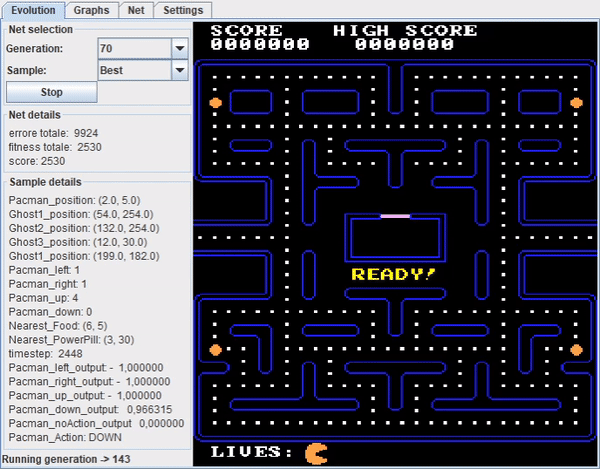
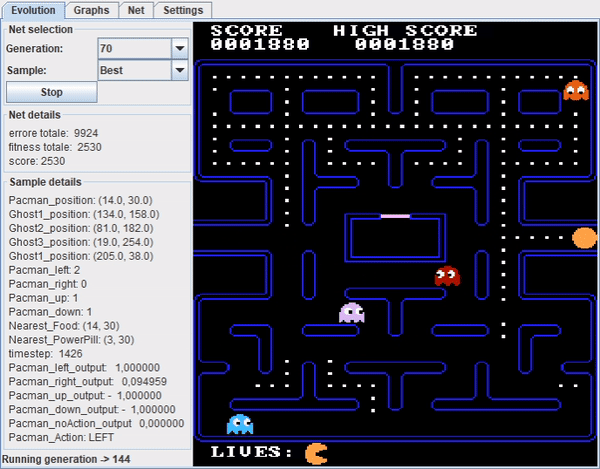
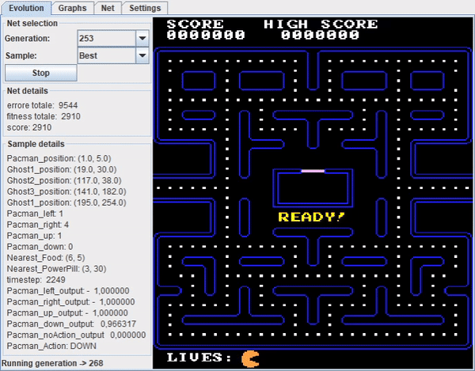
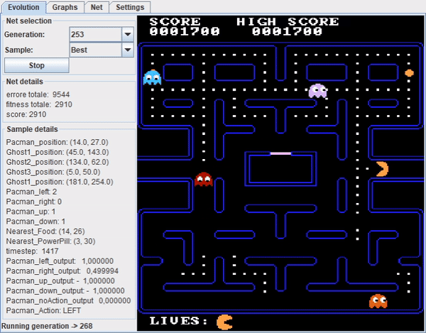

# NeuroEvoPacman

## Overview
The repository is intended to keep track of the progress of the project related to the Intelligent Systems course at Università degli Studi di Milano. 

## Info
The main idea was to model a Pac-Man player using a neural network and to train this model to succeed in playing the video game by itself by using a genetic algorithm (NEAT, see Links section). Some constraints had to be applied on the original problem (the video game rules) to simplify it and to reach some reasonable results. Several tests have been made by using different initial neural network topologies as well as different fitness functions, error functions and parameters for the adopted genetic algorithm.
Pac-Man implementation has been taken by an existing repo (see Links section) and re-adapted to the problem.

For more info, read the report inside the repository.

## Links
**Pac-Man implementation**: https://github.com/leonardo-ono/Java2DPacmanGame

**NEAT**: http://nn.cs.utexas.edu/?neat

## Demo

### Example 1

### Example 2

